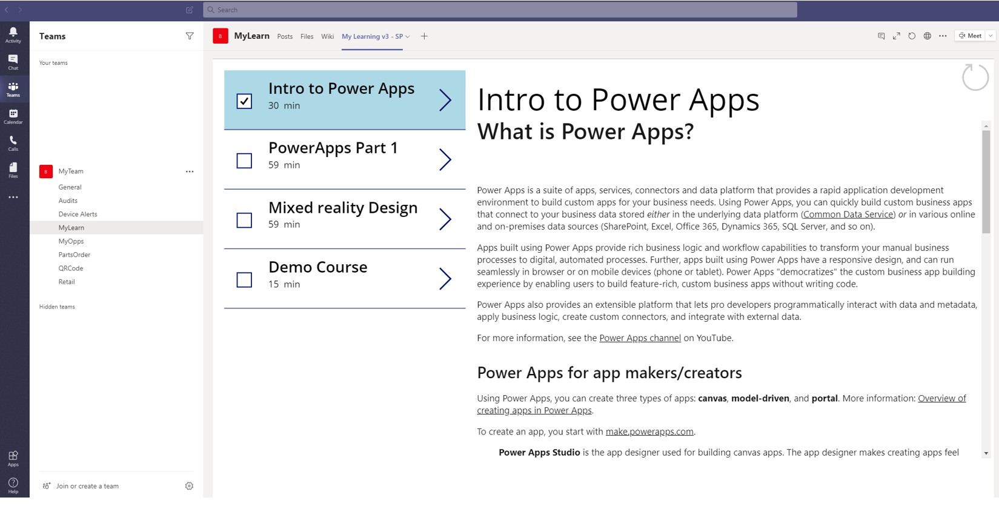
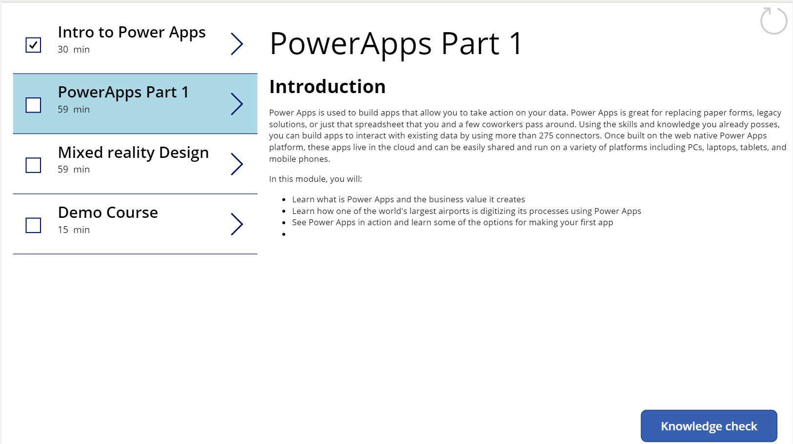
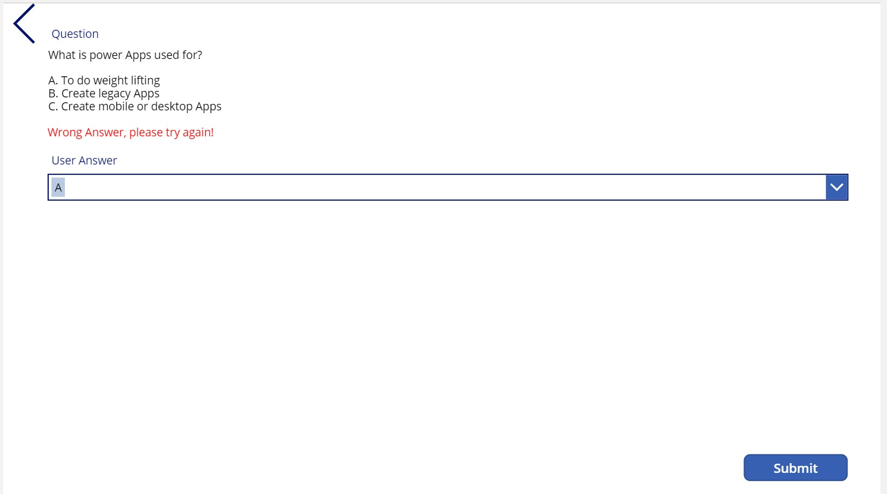
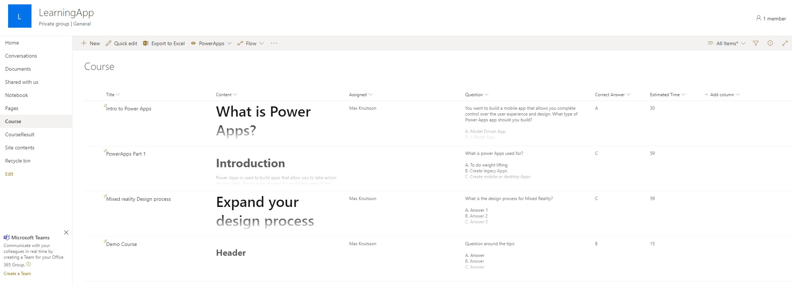
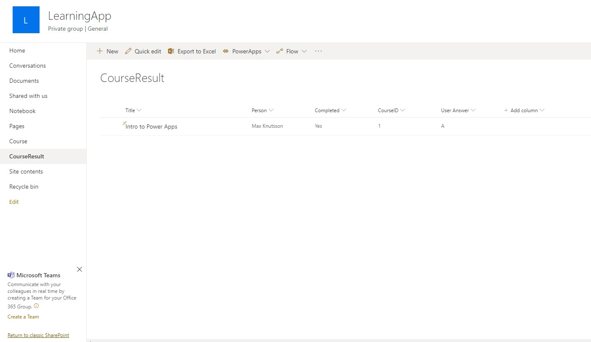

# Description
Simple Canvas app based on two Sharepoint Lists to create "My Learning" portal. 
It will grab published courses from a Sharepoint list, display for the logged in user. 
Ability to add one question as KnowledgeCheck to verify that students did the course.

## Screenshots






## Code snippets used inside the App. 
```c#
// 1. CourseList => TempalteFill. Create a background color for the selected course list
If(ThisItem.IsSelected,LightBlue)

// 2. CourseList => CheckBox => Default 
LookUp(CourseResult, CourseID = ThisItem.ID).Completed

// 3. CourseList => Knowledge Check Button => Visible 
If(LookUp(CourseResult, CourseID = CourseList.Selected.ID).Completed, false, true)

// 4. CourseList => Knowledge Check Button => OnSelect
NewForm(AnswerForm); Navigate(KnowledgeCheckScreen, ScreenTransition.Fade)

// 5. KnowledgeCheckScreen => Title_DataCardX => DataCardValue4 => Default
CourseList.Selected.Title

// 6. KnowledgeCheckScreen => CourseID_DataCardX => DataCardValueX => Default
CourseList.Selected.ID

// 7. KnowledgeCheckScreen => AnswerCheck => Default
If(First(CorrectAnswerForm.SelectedItems).Value = First(UserAnswerForm.SelectedItems).Value, true, false)

// 8. KnowledgeCheckScreen => Person_DataCardX => DataCardValueX => DefaultSelectedItems
If(
    AnswerForm.Mode=FormMode.New,
    {
        DisplayName: User().FullName,
        Claims: "i:0#.f|membership|" & Lower(User().Email)
    },
    Parent.Default
)

// 9. KnowledgeCheckScreen => SubmitAnswer => OnSelect
If(
    AnswerCheck.Value = true,
    SubmitForm(AnswerForm);
    Set(
        errMessage,
        ""
    );
    CompletedFormValue.Value = true; Refresh(Course);
    Navigate(
        ListScreen,
        ScreenTransition.Fade
    ),
    Set(
        errMessage,
        "Wrong Answer, please try again!"
    )
); 
```

## If you want to import the App
```bash
# 1. Go to PowerApps.com and login with your business account
#    Or create a community edition account https://powerapps.microsoft.com/sv-se/communityplan/
http://powerapps.com

# 2. On PowerApps.com, go to Apps => Import canvas app
PowerApps.com => Apps => Import canvas app

# 3. Upload App.zip provided in this repo. 
Upload MyLearningApp.zip 

# 4. Test the App, find it with name "My Learning v3 - SP" in your Environment
Open imported MyLearningApp 
```

# Requirements for SharePoint
You will need to create two SharePoint lists "Course" an "CourseResult"





## "Course" SharePoint list
```
Title - Single line text
Content - Multi-line with option "use enchanced rich text" 
Assigned - Person or group with "Allow selection of Groups"
Question - Multi-line text
Correct Answer - Choice with options "A, B, C"
Estimated Time - Number
```

## "CourseResult" SharePoint list
```
Title - Single line text
Person - Person
Completed - Yes/No
CourseID - Number
User Answer - Choice with options "A, B, C"
```
